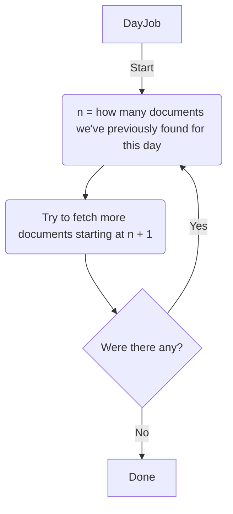
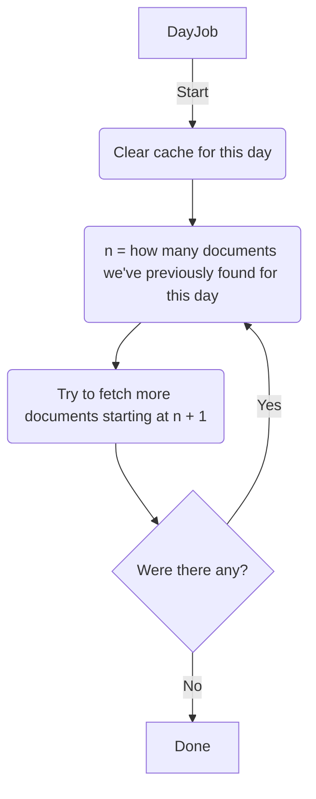

So apparently [666a](https://666a.se/) is still capable of surprising me. A few
months ago I wrote about the work I'd done to address an issue I've been calling
“[document lag](/2024/01/09/operating-666a/)”. Since then, I've continued to
keep a constant eye on the system's reliability. This week, something new
cropped up.

The investigation began when I did my usual round of manual checks of
Arbetsmiljöverket's public archive, comparing the canonical data there to the
notifications I've received recently from 666a. There was a document listed that
I hadn't received an email about, which is a worst case scenario for me. The
whole point of the service is for that not to happen, so it's my most feared
type of bug and basically a priority zero issue. Now that it's fixed, I wanted
to write up what was wrong and how I resolved it.

## The old system

At the core of 666a was this one cron job called the "day job". When it started,
the first thing it did was to check how many documents it saw last time it ran.
Then it'd add one to that number and start looking for more.

This approach depended on the assumption that new documents would always appear
at the end. I'd had my suspicions about this assumption, but it had always help
up. Until last week anyway.

## Diagnosis

Sometime around Tuesday I noticed
[a document](https://www.av.se/om-oss/sok-i-arbetsmiljoverkets-diarium/?id=2024/006453-5)
had been filed backdated to last Friday but never got picked up by 666a. When I
checked the data for Friday, I found the old “Day Job” was up to
[page 95 of the results](https://www.av.se/om-oss/sok-i-arbetsmiljoverkets-diarium/?page=95&sortDirection=Desc&sortOrder=Dokumentdatum&OnlyActive=False&FromDate=2024-03-01&ToDate=2024-03-01&ShowToolbar=True).

Thing is, the missing document wasn't on page 95. It wasn't on any of the pages
after it either. I took a deep breath and began clicking back through the
previous pages one by one. Eventually I came to
[page 84](https://www.av.se/om-oss/sok-i-arbetsmiljoverkets-diarium/?page=95&sortDirection=Desc&sortOrder=Dokumentdatum&OnlyActive=False&FromDate=2024-03-01&ToDate=2024-03-01&ShowToolbar=True),
and there it was.

## Implications

This design flaw meant that 666a would miss something in the region of 5% of all
documents filed. That's a bad enough number that there's no ifs or buts about
whether it needed fixing or how soon. This was a "fix-it-today" job.

Fix-it-today jobs are tricky these days. We've got a lot going on at home. I
have about 30 minutes tops in a given day for something like this. So not only
did I need an immediate fix for a design-level defect, but also it needed to be
a small code change that would be quick to implement and YOLO into production.

## The fix

By the time the kids were in bed the quick fix had occurred to me: empty the
search result cache for each day before updating it. This leads to the exact
same algorithm as before, except with a "delete" step added at the very
beginning.

That forces the job to re-fetch everything from scratch, beginning at page 1. It
means nothing gets missed. And importantly, it also made the fix easy to
implement. In fact, it was damn near a one line fix.

![Version control diff showing the addition of a line that reads “day.searches.destroy_all if options[:purge]” in a file called “app/jobs/work_environment/day_job.rb”](/2024/03/09/fix@1220x600.webp)

## Scaling it up

The downside of this fix is that dramatically increases the number of HTTP
requests necessary to check if new documents have been filed. My informal budget
I set for myself is that I try to keep the amount of requests I send to `av.se`
within the region of 1000 per day so that I'm as good as unnoticeable in terms
of the load I put on their service.

As part of my
[previous fixes to account for backdated filings](/2024/01/09/operating-666a/)
I'd programmed 666a to check the past 64 days every day. Checking all 64 on a
cold cache would blow that informal 1000 requests budget. I'm really happy with
the compromise I came up with here. Instead of checking every day sequentially,
like `1.days.ago`, `2.days.ago`, `3.days.ago`, `4.days.ago`, `5.days.ago` and so
on up to 64, I switched to powers of two. So instead I'm checking `1.days.ago`,
`2.days.ago`, `4.days.ago`, `8.days.ago` and so on.

In practice this won't lead to any significant notification delays, because the
vast majority of documents are listed the day after their filing date anyway.
And the decrease in days checked compensates _perfectly_ for the increase in
number of requests necessary to check a day. I actually keep statistics about
how many requests to `av.se` I make per day, and the chart really drives home
how steady the numbers stay despite the change.

## What's next?

It's great fun having this kind of side project to look after. This one in
particular feels like maintaining an old motorbike or something. A Rails app
with a cron job that sends email notifications is kind of a retro combination at
this point. And it's running beautifully now. Dead happy with it.

By now, 666a has processed over a quarter of a million documents and sent over a
thousand notification emails. It's crystal clear the demand exists for the
service. The daily email volume still fits within SendGrid's free tier, but it's
growing steadily enough that I've already taken the time to get pre-approved for
a paid subscription when the time comes.

If I'd shipped it as a “beta” – and maybe I should have – this would probably be
the moment I'd officially say it was “out of beta”. Right now my worst fear
would be for somebody at Arbetsmiljöverket to suddenly ship a redesign of the
diarium search feature. Especially if that redesign depended on JavaScript and
reworked all the logic around sorting, filtering and pagination. So let's all
cross our fingers for that not to happen!
