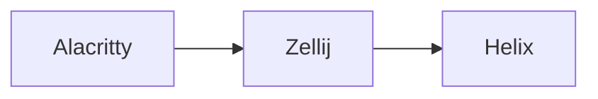

---
title:
image: /2025/12/12/gdgr@1024x708.webp
  What happens if you press 'x' in Helix in a Zellij pane running in Alacritty?
tags: [blog, devtools]
layout: layout-post
---

One of the little things that inspired me to learn some Rust was the realisation
that suddenly all the tools I'm using every day are built with it. In
particular, Alacritty, Zellij and Helix are the bedrock of my workflow and
they're all written in Rust.

It felt like an interesting Rust learning exerise to try to understand the
journey of a single keystroke through that stack. So iI have Helix running
inside a Zellij pane in an Alacritty window and I press `x` on my keyboard, what
kind of adventure does that keypress go on?

## Alacritty

The [`handle_event()`](https://github.com/alacritty/alacritty/blob/18372031d1f1bda853b2027b7ef1c75b45942829/alacritty/src/event.rs#L1836) function is the topmost entrypoint. Here the keypress
traverses a pair of nested [`match` blocks](https://doc.rust-lang.org/rust-by-example/flow_control/match.html). The outermost match block filters
by [`winit::Event`](https://docs.rs/winit/0.30.12/winit/event/index.html) type, of which a keypress is a [`WindowEvent`](https://docs.rs/winit/0.30.12/winit/event/enum.WindowEvent.html). The
innermost block filters by the variant of `WindowEvent`, which in this case is
[`KeyboardInput`](https://docs.rs/winit/0.30.12/winit/event/enum.WindowEvent.html#variant.KeyboardInput).

All that filtering leads to a call to [`key_input()`](https://github.com/alacritty/alacritty/blob/18372031d1f1bda853b2027b7ef1c75b45942829/alacritty/src/input/keyboard.rs#L22). This is a wonderfully
readable function with nice little explanatory comments for each early return.
None of those guard clauses apply to our simple `x` keypress, which makes it all
the way to the `write_to_pty()` call at the very end.

That [`write_to_pty()`](https://github.com/alacritty/alacritty/blob/18372031d1f1bda853b2027b7ef1c75b45942829/alacritty/src/event.rs#L687-L689) call brings us right back to `event.rs`, where a
single-line function passes the value directly to a `notify()` call. I got a
little stuck here, because when you use `gd` to navigate to the definition of
the `notify()` function you end up in some kind of trait instead of the
implementation. Eventually I found my way past that by using `gr` on the trait
to list references to it and find the real implementation.

<figure>
 <video
  poster="/2025/12/12/gdgr@1024x708.webp"
  src="/2025/12/12/gdgr@1024x706.mp4"
  title="Screen recording of Helix navigation workflow to bypass trait"
  controls
  preload="none"
  playsinline>
 </video>
 <figcaption>
  Bypassing a trait to find the real implementation in Helix.
 </figcaption>
</figure>

We land in a [`notify()`](https://github.com/alacritty/alacritty/blob/18372031d1f1bda853b2027b7ef1c75b45942829/alacritty_terminal/src/event_loop.rs#L335-L347) implementation inside a struct that contains an
`EventLoopSender`, which is a pretty big clue as to what happens next. Our
keypress becomes a `Msg::Input` on the event loop as a result of the code in
`notify()`.

That `Msg::Input` is read back out of the event loop in
[`drain_recv_channel()`](https://github.com/alacritty/alacritty/blob/18372031d1f1bda853b2027b7ef1c75b45942829/alacritty_terminal/src/event_loop.rs#L91). It puts it into a write queue called [`write_list`](https://github.com/alacritty/alacritty/blob/18372031d1f1bda853b2027b7ef1c75b45942829/alacritty_terminal/src/event_loop.rs#L401).
Later a [`goto_next()`](https://github.com/alacritty/alacritty/blob/18372031d1f1bda853b2027b7ef1c75b45942829/alacritty_terminal/src/event_loop.rs#L415-L417) call moves it into a value called [`writing`](https://github.com/alacritty/alacritty/blob/18372031d1f1bda853b2027b7ef1c75b45942829/alacritty_terminal/src/event_loop.rs#L402). As a
result of this, the subsequent call to [`pty_write()`](https://github.com/alacritty/alacritty/blob/18372031d1f1bda853b2027b7ef1c75b45942829/alacritty_terminal/src/event_loop.rs#L174) sends the keypress data
to `pty.writer().write()`.

That final [`write()`](https://doc.rust-lang.org/stable/std/fs/fn.write.html) call is happening on a [`std::fs::File`](https://doc.rust-lang.org/stable/std/fs/struct.File.html). We're at the
boundary between Alacritty and Zellij here, where data changes hands by writing
to virtual files in `/dev`. Alacritty writes the data to the master PTY file
descriptor and from there it's Zellij's problem.

## Zellij

The second leg of the keypress's journey begins in Zellij's [`stdin_loop()`](https://github.com/zellij-org/zellij/blob/b52f96c9460aa53c286bf313754b3db67c1d0033/zellij-client/src/stdin_handler.rs#L23)
function. This reads the data written by Alacritty and turns it into an
`InputInstruction::KeyEvent`. A call to `send_input_instructions.send()` hands
the event off to the input handler.

Zellij uses a message passing crate called [`crossbeam-channel`](https://crates.io/crates/crossbeam-channel) for this step.
That `send_input_instructions` struct is a [`crossbeam_channel::Sender`](https://docs.rs/crossbeam-channel/latest/crossbeam_channel/struct.Sender.html). And
there's a [`crossbeam_channel::Receiver`](https://docs.rs/crossbeam-channel/latest/crossbeam_channel/struct.Receiver.html) struct called
`receive_input_instructions` in [`handle_input()`](https://github.com/zellij-org/zellij/blob/b52f96c9460aa53c286bf313754b3db67c1d0033/zellij-client/src/input_handler.rs#L148) which receives the message
and passes the raw bytes into a call to [`handle_key()`](https://github.com/zellij-org/zellij/blob/b52f96c9460aa53c286bf313754b3db67c1d0033/zellij-client/src/input_handler.rs#L262-L275).

Those raw bytes are repackaged once again as a `ClientToServerMsg::Key`, which
is a big clue about what happens next. Zellij has a client-server architecture,
and up to now we've been in the client part. Inside [`route_thread_main()`](https://github.com/zellij-org/zellij/blob/b52f96c9460aa53c286bf313754b3db67c1d0033/zellij-server/src/route.rs#L1548), the
server receives the `ClientToServerMsg::Key` and passes it to [`route_action()`](https://github.com/zellij-org/zellij/blob/b52f96c9460aa53c286bf313754b3db67c1d0033/zellij-server/src/route.rs#L160)
as an `Action::Write`.

From there it's converted to a `ScreenInstruction::WriteCharacter` and passed to
`send_to_screen()`. That's picked up by [`screen_thread_main()`](https://github.com/zellij-org/zellij/blob/b52f96c9460aa53c286bf313754b3db67c1d0033/zellij-server/src/screen.rs#L3554) which sends it
onwards to [`tab.write_to_active_terminal()`](https://github.com/zellij-org/zellij/blob/b52f96c9460aa53c286bf313754b3db67c1d0033/zellij-server/src/tab/mod.rs#L2441).

Zellij then figures out the ID of the active pane and sends the keypress to it
by calling [`write_to_pane_id()`](https://github.com/zellij-org/zellij/blob/b52f96c9460aa53c286bf313754b3db67c1d0033/zellij-server/src/tab/mod.rs#L2515). There, it becomes a
`PtyWriteInstruction::Write` and makes its third crossbeam sender/receiver hop
via `send_to_pty_writer()` into [`pty_writer_main()`](https://github.com/zellij-org/zellij/blob/main/zellij-server/src/pty_writer.rs).

That forwards it on to [`write_to_tty_stdin()`](https://github.com/zellij-org/zellij/blob/b52f96c9460aa53c286bf313754b3db67c1d0033/zellij-server/src/os_input_output.rs#L663), which figures out the right
file descriptor for the terminal ID and uses [`nix::unistd::write()`](https://docs.rs/nix/latest/nix/unistd/fn.write.html) to write
the data to it. We're writing to a file again, which means we're at the border
between two programs. It's the end of the Zellij leg of the journey, and the
keypress is about to enter Helix.

## Helix

In Helix, a function called [`event_loop_until_idle()`](https://github.com/helix-editor/helix/blob/27e8bdb2f1ea83a0aefdb103cce662cb78ed55c2/helix-term/src/application.rs#L319) polls for events from
`stdin` and sends them to [`handle_terminal_events()`](https://github.com/helix-editor/helix/blob/27e8bdb2f1ea83a0aefdb103cce662cb78ed55c2/helix-term/src/application.rs#L688).

An `into()` call on the event takes us on a detour via a [`From` trait](https://doc.rust-lang.org/rust-by-example/conversion/from_into.html)'s
[`from()`](https://github.com/helix-editor/helix/blob/27e8bdb2f1ea83a0aefdb103cce662cb78ed55c2/helix-view/src/input.rs#L462-L476) function to convert from a [`termina::Event::KeyEvent`](https://docs.rs/termina/latest/termina/event/struct.KeyEvent.html) to Helix's
own internal `Event::Key` struct. That Helix event then goes into a
[`handle_event()`](https://github.com/helix-editor/helix/blob/27e8bdb2f1ea83a0aefdb103cce662cb78ed55c2/helix-term/src/compositor.rs#L144)
function which uses event bubbling to route it to the right part of Helix.

In the case of our `x` keypress, with Helix in insert mode, the right part of
Helix is the editor. The editor's own
[`handle_event()`](https://github.com/helix-editor/helix/blob/27e8bdb2f1ea83a0aefdb103cce662cb78ed55c2/helix-term/src/ui/editor.rs#L1358)
function routes the event to the [`insert_mode()`](https://github.com/helix-editor/helix/blob/27e8bdb2f1ea83a0aefdb103cce662cb78ed55c2/helix-term/src/ui/editor.rs#L916) function, which passes it on
to a function called [`insert_char()`](https://github.com/helix-editor/helix/blob/27e8bdb2f1ea83a0aefdb103cce662cb78ed55c2/helix-term/src/commands.rs#L4174).

The event then becomes a transaction which is applied to the document. The `x`
character from the keypress is now a part of the document but it's not yet
visible on the screen. The successful consumption of the event sets in motion a
render within Helix which will work its way back via Zellij to Alacritty.

I'm too exhausted from following the keypress down the chain to be arsed
following it back up. This was a fun exercise though. I learned a lot about
Rust, which was the point, but also about systems programming, which was
unintentional.

All three of these are tools I expect to use daily for a long time to come too,
so it feels really worthwhile to work towards understanding what makes them
tick. And Rust makes that a lot more feasible for me. I like C a lot, and
remember reading The C Programming Language very fondly, but I've always really
struggled to read real-world C code. It's fun finally being able to understand
stuff at this level.
